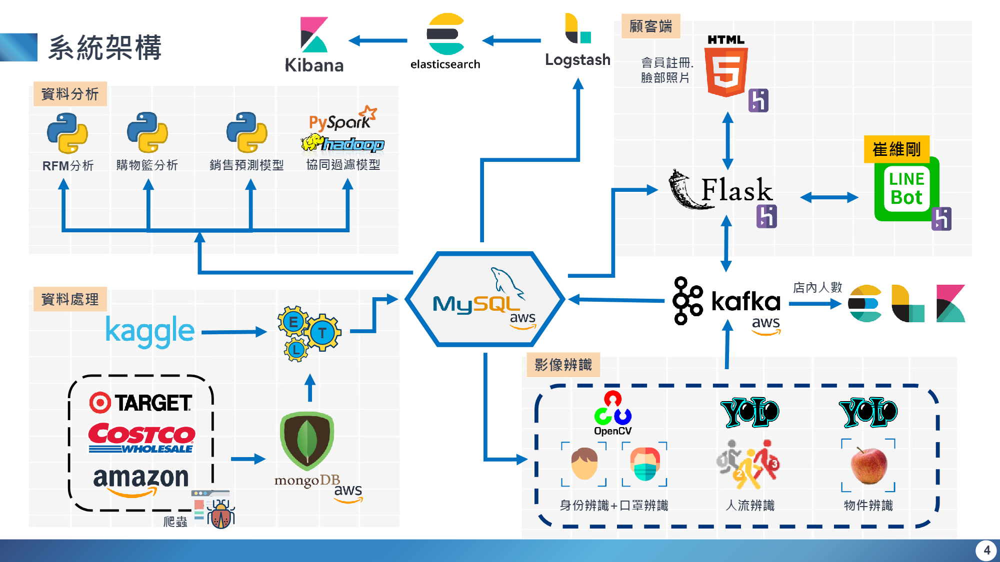

一、專題摘要 
=============
1. 專題主題 : 疫Shopping無人智慧商店

2. 專題基本目標 : 
  * 營運流程TEAM:
    - 人臉辨識
    - 商品辨識
    - 人流辨識
  * 資料處理分析TEAM:
    - 爬取商品網站資料
    - 分析Kaggle商店交易數據集資料
      - RFM分析
      - 購物籃分析
      - 銷售預測模型
      - 協同過濾模型
      - 資料視覺化(靜態&動態)

二、流程圖
=============

